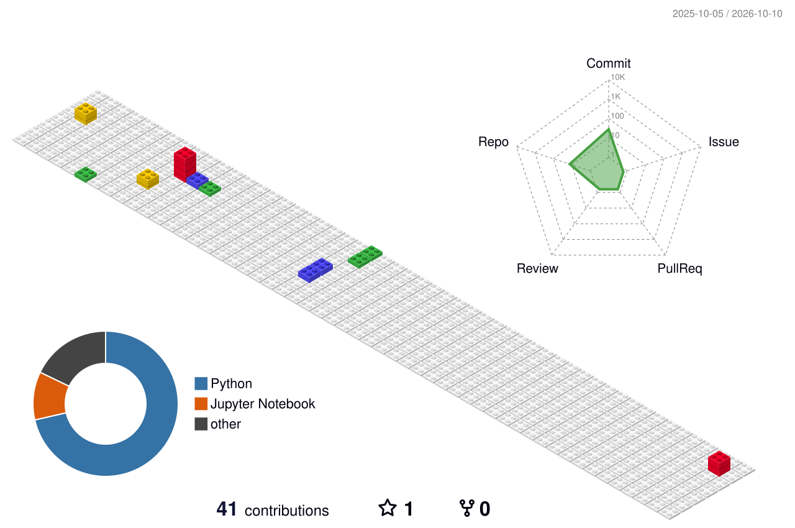

<div align="center">

<!-- Animated Typing -->


<br/><br/>

<!-- Badges -->
[](https://github.com/Aan9758)
[](https://github.com/Aan9758?tab=followers)
[](https://github.com/Aan9758)
[](https://github.com/Aan9758?tab=repositories)

</div>

---

## 🧠 About Me

```python
class AmanSaraswat:
    name       = "Aman Saraswat"
    institute  = "IIT Guwahati 🎓"
    location   = "India 🇮🇳"
    focus      = ["Zero-Hallucination AI", "LLM Orchestration", "FinTech AI", "Voice Interfaces"]
    languages  = ["Python", "JavaScript", "SQL"]
    currently  = "Building production-grade AI systems that don't hallucinate"
    open_to    = ["Collaborations", "Research", "SDE / ML Roles"]
    
    def mission(self):
        return "Bridge the gap between powerful AI and regulated, high-stakes domains"
```

<br/>

- 🎙️ Built **[VoiceFinAI](https://github.com/Aan9758/VoiceFinAI)** — a voice-first mutual fund advisor with a SHA-256 cryptographic anti-hallucination firewall, Deepgram Nova-3 + Groq LPU
- 🔒 Built **[FinShield RAG](https://github.com/Aan9758/finshield-rag)** — RBI-compliant financial AI assistant with RAG, multi-layer security, and cryptographic audit trails  
- 🐝 Built **[Swarm Ops](https://github.com/Aan9758/swarm-ops-project)** — production multi-agent AI swarm for e-commerce with FastAPI + WebSockets + LLM orchestration
- 🤖 Explored **[AI Browser Automation](https://github.com/Aan9758/ai-browser-automation-ag2)** with Playwright + AutoGen (AG2) + OpenAI
- 🫁 Applied deep learning to **[medical imaging](https://github.com/Aan9758/Pneumonia-Detection-DeepLearning)** (Pneumonia detection, 94%+ accuracy on chest X-rays)
- 💳 Built **[fraud detection](https://github.com/Aan9758/Fraud-Detection-Project)** models on real-world financial transaction data

---

## 🚀 Featured Projects

<div align="center">

| Project | Stack | What It Does |
|:--------|:-----:|:-------------|
| [**🎙️ VoiceFinAI**](https://github.com/Aan9758/VoiceFinAI) | `Python` `Flask` `Groq` `Deepgram` `Edge-TTS` | Zero-hallucination conversational voice AI for Indian mutual funds — SHA-256 AuditStream firewall, Hindi/English |
| [**🔒 FinShield RAG**](https://github.com/Aan9758/finshield-rag) | `Python` `RAG` `LLM` `FastAPI` | RBI-compliant financial AI — multi-layer security, verified retrieval, cryptographic audit trails |
| [**🐝 Swarm Ops**](https://github.com/Aan9758/swarm-ops-project) | `Python` `FastAPI` `WebSockets` | Production multi-agent AI swarm for e-commerce — real-time LLM task coordination |
| [**🤖 AI Browser Agent**](https://github.com/Aan9758/ai-browser-automation-ag2) | `Playwright` `AutoGen` `OpenAI` | AI-driven browser automation using the AG2 multi-agent framework |
| [**💳 Fraud Detector**](https://github.com/Aan9758/Fraud-Detection-Project) | `Scikit-learn` `Pandas` | Proactive financial fraud detection — Random Forest + Gradient Boosting |
| [**🫁 Pneumonia AI**](https://github.com/Aan9758/Pneumonia-Detection-DeepLearning) | `PyTorch` `CNN` `OpenCV` | Deep CNN for pneumonia detection from chest X-ray images (94%+ accuracy) |

</div>

---

## 🛠️ Tech Stack

<div align="center">

**🤖 AI / ML / LLMs**

[](https://python.org)
[](https://pytorch.org)
[](https://tensorflow.org)
[](https://openai.com)
[](https://jupyter.org)
&nbsp;


**⚙️ Backend & Infrastructure**

[](https://flask.palletsprojects.com)
[](https://fastapi.tiangolo.com)
[](https://docker.com)
[](https://postgresql.org)
[](https://redis.io)
[](https://git-scm.com)
[](https://github.com)
[](https://linux.org)

**📊 Data & Web**

[](https://developer.mozilla.org/en-US/docs/Web/JavaScript)
[](https://developer.mozilla.org/en-US/docs/Web/HTML)
[](https://developer.mozilla.org/en-US/docs/Web/CSS)
&nbsp;


</div>

---

## 📊 GitHub Stats

<div align="center">


&nbsp;&nbsp;


</div>

<div align="center">

[](https://git.io/streak-stats)

</div>

---

## 🌐 3D Contribution Graph

<div align="center">

<a href="https://github.com/Aan9758">
  
</a>

</div>

---

## 📈 Contribution Activity

<div align="center">

[](https://github.com/Aan9758)

</div>

---

## 🐍 Contribution Snake

<div align="center">

<picture>
  <source media="(prefers-color-scheme: dark)" srcset="https://raw.githubusercontent.com/Aan9758/Aan9758/output/github-contribution-grid-snake-dark.svg" />
  <source media="(prefers-color-scheme: light)" srcset="https://raw.githubusercontent.com/Aan9758/Aan9758/output/github-contribution-grid-snake.svg" />
  
</picture>

</div>

---

## 🏆 GitHub Trophies

<div align="center">

[](https://github.com/ryo-ma/github-profile-trophy)

</div>

---


<div align="center">

*"The best way to predict the future is to build it — with AI that you can actually trust."*

**⭐ Star my repos if you find them useful · Let's connect and build something remarkable**

[](https://linkedin.com/in/amansaraswat)
[](mailto:a.saraswat@iitg.ac.in)
[](https://github.com/Aan9758)

</div>
